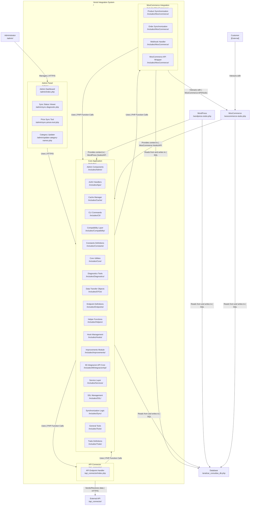

# Unnamed CodeViz Diagram

```mermaid
graph TD

    admin["Administrator<br>/admin/"]
    customer["Customer<br>[External]"]
    wordpress["WordPress<br>/wordpress-stubs.php"]
    woocommerce["WooCommerce<br>/woocommerce-stubs.php"]
    external_api["External API<br>/api_connector/"]
    database["Database<br>/analizar_consultas_db.php"]
    subgraph verial_integration_system_boundary["Verial Integration System<br>/"]
        subgraph admin_panel_boundary["Admin Panel<br>/admin/"]
            admin_dashboard["Admin Dashboard<br>/admin/index.php"]
            sync_status_viewer["Sync Status Viewer<br>/admin/sync-diagnostic.php"]
            price_sync_tool["Price Sync Tool<br>/admin/sync-prices-tool.php"]
            category_updater["Category Updater<br>/admin/update-category-names.php"]
        end
        subgraph api_connector_boundary["API Connector<br>/api_connector/"]
            api_endpoint_handler["API Endpoint Handler<br>/api_connector/index.php"]
        end
        subgraph core_app_boundary["Core Application<br>/includes/"]
            admin_components["Admin Components<br>/includes/Admin/"]
            ajax_handlers["AJAX Handlers<br>/includes/Ajax/"]
            cache_manager["Cache Manager<br>/includes/Cache/"]
            cli_commands["CLI Commands<br>/includes/Cli/"]
            compatibility_layer["Compatibility Layer<br>/includes/Compatibility/"]
            constants_definitions["Constants Definitions<br>/includes/Constants/"]
            core_utilities["Core Utilities<br>/includes/Core/"]
            diagnostics_tools["Diagnostics Tools<br>/includes/Diagnostics/"]
            data_transfer_objects["Data Transfer Objects<br>/includes/DTOs/"]
            endpoint_definitions["Endpoint Definitions<br>/includes/Endpoints/"]
            helper_functions["Helper Functions<br>/includes/Helpers/"]
            hook_management["Hook Management<br>/includes/Hooks/"]
            improvements_module["Improvements Module<br>/includes/Improvements/"]
            mi_integracion_api_core["Mi Integracion API Core<br>/includes/MiIntegracionApi/"]
            service_layer["Service Layer<br>/includes/Services/"]
            ssl_management["SSL Management<br>/includes/SSL/"]
            synchronization_logic["Synchronization Logic<br>/includes/Sync/"]
            general_tools["General Tools<br>/includes/Tools/"]
            traits_definitions["Traits Definitions<br>/includes/Traits/"]
        end
        subgraph woocommerce_integration_boundary["WooCommerce Integration<br>/includes/WooCommerce/"]
            product_sync["Product Synchronization<br>/includes/WooCommerce/"]
            order_sync["Order Synchronization<br>/includes/WooCommerce/"]
            webhook_handler["Webhook Handler<br>/includes/WooCommerce/"]
            woocommerce_api_wrapper["WooCommerce API Wrapper<br>/includes/WooCommerce/"]
        end
        %% Edges at this level (grouped by source)
        admin_panel_boundary["Admin Panel<br>/admin/"] -->|"Uses | HTTP/S"| core_app_boundary["Core Application<br>/includes/"]
        api_connector_boundary["API Connector<br>/api_connector/"] -->|"Uses | PHP Function Calls"| core_app_boundary["Core Application<br>/includes/"]
        core_app_boundary["Core Application<br>/includes/"] -->|"Uses | PHP Function Calls"| api_connector_boundary["API Connector<br>/api_connector/"]
        core_app_boundary["Core Application<br>/includes/"] -->|"Uses | PHP Function Calls"| woocommerce_integration_boundary["WooCommerce Integration<br>/includes/WooCommerce/"]
        woocommerce_integration_boundary["WooCommerce Integration<br>/includes/WooCommerce/"] -->|"Uses | PHP Function Calls"| core_app_boundary["Core Application<br>/includes/"]
    end
    %% Edges at this level (grouped by source)
    api_connector_boundary["API Connector<br>/api_connector/"] -->|"Sends/Receives data | HTTP/S"| external_api["External API<br>/api_connector/"]
    woocommerce_integration_boundary["WooCommerce Integration<br>/includes/WooCommerce/"] -->|"Interacts with | WooCommerce API/Hooks"| woocommerce["WooCommerce<br>/woocommerce-stubs.php"]
    woocommerce_integration_boundary["WooCommerce Integration<br>/includes/WooCommerce/"] -->|"Reads from and writes to | SQL"| database["Database<br>/analizar_consultas_db.php"]
    core_app_boundary["Core Application<br>/includes/"] -->|"Reads from and writes to | SQL"| database["Database<br>/analizar_consultas_db.php"]
    admin["Administrator<br>/admin/"] -->|"Manages | HTTP/S"| admin_panel_boundary["Admin Panel<br>/admin/"]
    customer["Customer<br>[External]"] -->|"Interacts with"| woocommerce["WooCommerce<br>/woocommerce-stubs.php"]
    wordpress["WordPress<br>/wordpress-stubs.php"] -->|"Reads from and writes to | SQL"| database["Database<br>/analizar_consultas_db.php"]
    wordpress["WordPress<br>/wordpress-stubs.php"] -->|"Provides context to | WordPress Hooks/API"| core_app_boundary["Core Application<br>/includes/"]
    woocommerce["WooCommerce<br>/woocommerce-stubs.php"] -->|"Reads from and writes to | SQL"| database["Database<br>/analizar_consultas_db.php"]
    woocommerce["WooCommerce<br>/woocommerce-stubs.php"] -->|"Provides context to | WooCommerce Hooks/API"| core_app_boundary["Core Application<br>/includes/"]

```
---
*Generated by [CodeViz.ai](https://codeviz.ai) on 10/9/2025, 19:09:47*
