# Arquitectura del Sistema de Logging

## Diagrama de Estructura Refinado

```mermaid
graph TB
    subgraph "Sistema de Logging Centralizado"
        subgraph "Interfaces"
            ILogger["ILogger<br/>PSR-3 Interface"]
            ILogManager["ILogManager<br/>Gestión de Instancias"]
            ILogConfig["ILogConfiguration<br/>Configuración Centralizada"]
        end
        
        subgraph "Core"
            Logger["Logger<br/>PSR-3 Puro"]
            LogManager["LogManager<br/>Gestión Real"]
            LogRotator["LogRotator<br/>Rotación de Archivos"]
        end
        
        subgraph "Factory"
            LoggerFactory["LoggerFactory<br/>Creación Unificada"]
            LogManagerFactory["LogManagerFactory<br/>Factory para LogManager"]
        end
        
        subgraph "Configuration"
            LogConfig["LogConfiguration<br/>Configuración Centralizada"]
            EnvConfig["EnvironmentConfig<br/>Config por Entorno"]
            CategoryConfig["CategoryConfig<br/>Config por Categoría"]
        end
        
        subgraph "Security"
            SensitiveFilter["SensitiveDataFilter<br/>Filtrado de Datos"]
        end
        
        subgraph "Traits"
            LoggingTrait["LoggingTrait<br/>Logging Básico"]
            CategoryTrait["CategoryLoggerTrait<br/>Logging por Categoría"]
        end
    end
    
    subgraph "Sistemas de Integración"
        MainPlugin["MainPluginAccessor<br/>Trait Centralizado"]
        DependencyContainer["DependencyContainer<br/>Inyección de Dependencias"]
        ConfigManager["ConfigManager<br/>Configuración Global"]
    end
    
    subgraph "Clases Cliente"
        SyncManager["Sync_Manager<br/>Usa MainPluginAccessor"]
        WooCommerceHooks["WooCommerceHooks<br/>Usa MainPluginAccessor"]
        Endpoints["Endpoints<br/>Usa CategoryLoggerTrait"]
        AdminClasses["Admin Classes<br/>Usa LoggerFactory"]
    end
    
    subgraph "Sistemas Deprecados"
        LoggerAuditoria["LoggerAuditoria<br/>DEPRECADO"]
        OldLogger["Logger Actual<br/>Helpers/Logger.php"]
        OldLogManager["LogManager Actual<br/>Core/LogManager.php"]
    end
    
    %% Relaciones de Implementación
    Logger --> ILogger
    LogManager --> ILogManager
    LogConfig --> ILogConfig
    
    %% Relaciones de Uso
    LoggerFactory --> Logger
    LoggerFactory --> LogConfig
    LogManagerFactory --> LogManager
    LogManager --> Logger
    LogManager --> LogConfig
    
    %% Relaciones de Configuración
    LogConfig --> EnvConfig
    LogConfig --> CategoryConfig
    Logger --> SensitiveFilter
    
    %% Relaciones de Integración
    MainPlugin --> LoggerFactory
    DependencyContainer --> LoggerFactory
    ConfigManager --> LogConfig
    
    %% Relaciones de Clientes
    SyncManager --> MainPlugin
    WooCommerceHooks --> MainPlugin
    Endpoints --> CategoryTrait
    AdminClasses --> LoggerFactory
    
    %% Relaciones de Migración
    OldLogger -.-> Logger
    OldLogManager -.-> LogManager
    LoggerAuditoria -.-> Logger
    
    %% Estilos
    classDef interface fill:#e1f5fe
    classDef core fill:#f3e5f5
    classDef factory fill:#e8f5e8
    classDef config fill:#fff3e0
    classDef security fill:#ffebee
    classDef trait fill:#fce4ec
    classDef integration fill:#e0f2f1
    classDef client fill:#f5f5f5
    classDef deprecated fill:#ffcdd2,stroke-dasharray: 5 5
    
    class ILogger,ILogManager,ILogConfig interface
    class Logger,LogManager,LogRotator core
    class LoggerFactory,LogManagerFactory factory
    class LogConfig,EnvConfig,CategoryConfig config
    class SensitiveFilter security
    class LoggingTrait,CategoryTrait trait
    class MainPlugin,DependencyContainer,ConfigManager integration
    class SyncManager,WooCommerceHooks,Endpoints,AdminClasses client
    class LoggerAuditoria,OldLogger,OldLogManager deprecated
```

## Principios Aplicados

### 1. **Single Responsibility Principle (SRP)**
- Cada clase tiene una responsabilidad específica
- Separación clara de concerns

### 2. **Dependency Inversion Principle (DIP)**
- Las clases dependen de interfaces, no implementaciones
- Fácil intercambio de implementaciones

### 3. **Factory Pattern**
- Creación centralizada de objetos
- Control de instanciación

### 4. **Configuration Pattern**
- Configuración centralizada
- Separación de configuración y lógica

## Flujo de Uso Refinado

### **Flujo Principal (Clases con MainPluginAccessor)**
1. **Cliente** (Sync_Manager, WooCommerceHooks) usa `getCentralizedLogger()`
2. **MainPluginAccessor** consulta **LoggerFactory**
3. **LoggerFactory** consulta **LogConfiguration**
4. **LogConfiguration** determina configuración según entorno y categoría
5. **LoggerFactory** crea/retorna instancia de **Logger** o **LogManager**
6. **Cliente** usa logger para registrar mensajes

### **Flujo Alternativo (Clases Admin)**
1. **Cliente** (Admin Classes) usa **LoggerFactory** directamente
2. **LoggerFactory** consulta **LogConfiguration**
3. **LoggerFactory** crea instancia de **Logger**
4. **Cliente** usa logger para registrar mensajes

### **Flujo por Traits (Endpoints)**
1. **Cliente** (Endpoints) usa **CategoryLoggerTrait**
2. **Trait** inicializa logger con categoría específica
3. **Trait** delega a **LoggerFactory**
4. **Cliente** usa métodos de conveniencia del trait

## Beneficios de la Arquitectura Refinada

### **Arquitectura**
- ✅ **SRP**: Cada clase una responsabilidad específica
- ✅ **OCP**: Extensible sin modificar código existente
- ✅ **LSP**: Interfaces intercambiables
- ✅ **ISP**: Interfaces específicas por responsabilidad
- ✅ **DIP**: Dependencias invertidas

### **Funcionalidad**
- ✅ **PSR-3 Compliance**: Implementación estándar completa
- ✅ **Singleton por Categoría**: Reutilización eficiente de instancias
- ✅ **Configuración Centralizada**: Un solo punto de verdad
- ✅ **Seguridad Integrada**: Filtrado automático de datos sensibles
- ✅ **Rotación de Logs**: Gestión automática de archivos

### **Integración**
- ✅ **MainPluginAccessor**: Integración con sistema centralizado
- ✅ **DependencyContainer**: Compatibilidad con inyección de dependencias
- ✅ **ConfigManager**: Integración con configuración global
- ✅ **Backward Compatibility**: Migración gradual posible

### **Mantenibilidad**
- ✅ **Modularidad**: Componentes independientes y cohesivos
- ✅ **Testabilidad**: Interfaces bien definidas para mocking
- ✅ **Documentación**: PHPDoc completo en todas las clases
- ✅ **Deprecación Gradual**: Eliminación segura de código obsoleto

### **Performance**
- ✅ **Reutilización de Instancias**: Singleton por categoría
- ✅ **Lazy Loading**: Creación bajo demanda
- ✅ **Configuración Caché**: Configuración en memoria
- ✅ **Rotación Optimizada**: Gestión eficiente de archivos

